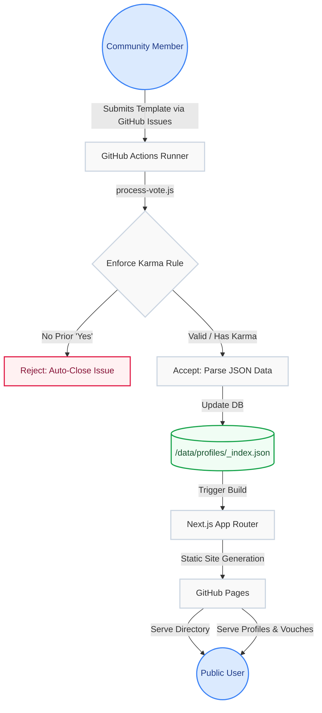

# Professional Health Ledger

A transparent, GitHub-native professional verification system. Community members share genuine work experiences by answering one question: **"Based on your experience, would you work with/for them again?"**

## How It Works

1. **Submit a Vote** — Open a GitHub Issue using the structured template. Provide a LinkedIn URL and your Yes/No answer.
2. **Automated Processing** — A GitHub Action parses the issue, enforces the Karma Rule, and updates the public ledger.
3. **Public Ledger** — Browse verified profiles and see aggregate community sentiment on the Next.js frontend.

## Architecture



## The Karma Rule

Before submitting a "No" vote, you must have at least one "Yes" contribution on record. This ensures the community is rooted in positive engagement and prevents anonymous drive-by negativity.

## Tech Stack

- **Frontend:** Next.js (App Router) deployed to GitHub Pages
- **Database:** JSON files in `/data/` committed to the repository
- **Automation:** GitHub Actions triggered by issue events
- **Identity:** GitHub usernames (submitters) + LinkedIn URLs (subjects)

## Project Structure

```
├── data/
│   ├── profiles/_index.json   # All verified profiles with vote counts
│   └── users/_index.json      # All contributors with karma status
├── scripts/
│   └── process-vote.js        # Vote processing logic (run by GitHub Actions)
├── src/app/
│   ├── page.js                # Landing page
│   ├── profiles/page.js       # Profile browser with search
│   ├── contributors/page.js   # Contributor leaderboard
│   ├── submit/page.js         # Submission instructions
│   └── api/                   # API routes for data access
├── .github/
│   ├── ISSUE_TEMPLATE/        # Structured vote submission form
│   └── workflows/             # GitHub Action for processing votes
```

## Getting Started

```bash
npm install
npm run dev
```

Open [http://localhost:3000](http://localhost:3000) to view the site.

## Setup for GitHub

1. Create the repository: `gh repo create muglikar/ProHealthLedger --public --source=. --push`
2. Enable Actions write permissions: Settings → Actions → General → Workflow permissions → Read and write
3. Votes are submitted via GitHub Issues and processed automatically

## Future Scope

1. **Profile Image Extraction:** Automatically extracting the image of the professional from LinkedIn or search engines. If automated extraction is restricted, the platform will utilize manual assistance from vouchers/flaggers when they submit votes.
2. **Deep Professional Research:** Conducting deep background research on a professional using comprehensive search engine aggregation and LLM analysis to ascertain the true professional nature of an individual. This premium deep research report will be available for a fee of **Rs. 501** for Indian users and **$5** for international users.
3. **Professional Knowledge Graph:** Constructing an interactive knowledge graph that maps the complex network of relationships between individuals, vouchers, flaggers, and the companies they work for or report to.

## Legal

This ledger is a collection of subjective professional experiences. The platform does not author or verify these ratings. LinkedIn URLs are used as identifiers leveraging publicly available data. Professionals can request profile removal by opening a deactivation issue.

## License

MIT


---
*Scientific Deployment Trigger: Wed May  6 01:47:06 IST 2026*
