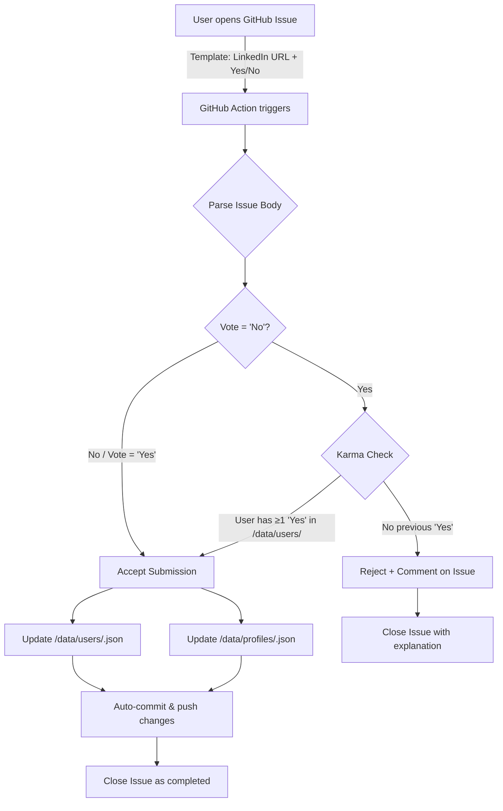

# ProHealthLedger — GitHub-Native Professional Verification Ledger

A public, transparent system where **any LinkedIn professional** is community-verified via GitHub Issues. A Next.js frontend displays profiles stored as JSON in the repo. GitHub Actions process issue-based submissions, enforce a **Karma Rule** (you must vouch for someone before you can flag someone), and auto-commit updated data.

---

## User Review Required

> [!IMPORTANT]
> **Repository Naming**: The repo will be initialized in `/Users/anandmuglikar/Documents/pers/Expt/ProHealthLedger`. You'll need to create the GitHub remote (`gh repo create ProHealthLedger --public`) separately or I can run it for you if `gh` CLI is installed.

> [!IMPORTANT]
> **GitHub Token for Actions**: The workflow uses the built-in `GITHUB_TOKEN` to commit JSON changes back to the repo. No extra secrets are needed, but the repo's Actions permissions must allow read/write for workflows (Settings → Actions → General → Workflow permissions → Read and write).

> [!WARNING]
> **Public Data**: All profile data and user contribution history will be publicly visible in the repo. LinkedIn URLs and GitHub usernames will be exposed. Ensure this aligns with privacy expectations.

---

## System Architecture



---

## Proposed Changes

### Repository Foundation

#### [NEW] [package.json](file:///Users/anandmuglikar/Documents/pers/Expt/ProHealthLedger/package.json)
Next.js project initialized with `npx -y create-next-app@latest ./` (App Router, no Tailwind — vanilla CSS).

#### [NEW] [README.md](file:///Users/anandmuglikar/Documents/pers/Expt/ProHealthLedger/README.md)
Project overview, how to contribute, Karma Rule explanation.

---

### Data Layer

#### [NEW] [data/profiles/\_index.json](file:///Users/anandmuglikar/Documents/pers/Expt/ProHealthLedger/data/profiles/_index.json)
Master index of all profiles. Each profile entry:
```json
{
  "linkedin_url": "https://linkedin.com/in/jane-doe",
  "slug": "jane-doe",
  "votes": { "yes": 3, "no": 1 },
  "submissions": [
    { "user": "gh-username", "vote": "yes", "issue": 42, "date": "2026-03-14" }
  ]
}
```

#### [NEW] [data/users/\_index.json](file:///Users/anandmuglikar/Documents/pers/Expt/ProHealthLedger/data/users/_index.json)
Master index of all contributing users. Each user entry:
```json
{
  "github_username": "octocat",
  "contributions": [
    { "profile_slug": "jane-doe", "vote": "yes", "issue": 42, "date": "2026-03-14" }
  ],
  "yes_count": 1,
  "no_count": 0
}
```

---

### GitHub Issue Template

#### [NEW] [.github/ISSUE_TEMPLATE/submit-vote.yml](file:///Users/anandmuglikar/Documents/pers/Expt/ProHealthLedger/.github/ISSUE_TEMPLATE/submit-vote.yml)
YAML-based issue form:
- **LinkedIn URL** (required, text input, validated as URL)
- **Vote** (required, dropdown: `Yes` / `No`)
- **Reason** (optional, textarea)

---

### GitHub Action — Issue Processor

#### [NEW] [.github/workflows/process-issue.yml](file:///Users/anandmuglikar/Documents/pers/Expt/ProHealthLedger/.github/workflows/process-issue.yml)
Workflow triggers on `issues: [opened]`. Steps:
1. Checkout repo
2. Parse issue body (extract LinkedIn URL, vote, submitter username)
3. Run processing script

#### [NEW] [scripts/process-vote.js](file:///Users/anandmuglikar/Documents/pers/Expt/ProHealthLedger/scripts/process-vote.js)
Node.js script executed by the Action:
1. **Parse** the issue body for LinkedIn URL and vote
2. **Karma Rule check**: if vote is `No`, read `/data/users/_index.json` and verify `yes_count >= 1` for the submitter
3. If Karma fails → post a comment explaining the rule → close issue → exit
4. **Slug generation**: derive slug from LinkedIn URL (e.g., `jane-doe`)
5. **Update `/data/profiles/_index.json`**: add/update the profile entry with the new vote
6. **Update `/data/users/_index.json`**: add/update the user entry
7. **Commit & push** the changes via git commands
8. **Close issue** as completed with a summary comment

---

### Next.js Frontend

#### [NEW] [src/app/layout.js](file:///Users/anandmuglikar/Documents/pers/Expt/ProHealthLedger/src/app/layout.js)
Root layout with Google Font (Inter), global CSS, navigation header.

#### [NEW] [src/app/page.js](file:///Users/anandmuglikar/Documents/pers/Expt/ProHealthLedger/src/app/page.js)
Landing page — hero section explaining the project (verify any professional on LinkedIn), how it works, call-to-action to submit.

#### [NEW] [src/app/profiles/page.js](file:///Users/anandmuglikar/Documents/pers/Expt/ProHealthLedger/src/app/profiles/page.js)
Lists all profiles from `/data/profiles/_index.json` with vote counts, links to LinkedIn, search/filter.

#### [NEW] [src/app/contributors/page.js](file:///Users/anandmuglikar/Documents/pers/Expt/ProHealthLedger/src/app/contributors/page.js)
Leaderboard of contributors from `/data/users/_index.json`, showing karma status and contribution counts.

#### [NEW] [src/app/submit/page.js](file:///Users/anandmuglikar/Documents/pers/Expt/ProHealthLedger/src/app/submit/page.js)
Instructions page with a direct link to create a new GitHub Issue using the template.

#### [NEW] [src/app/globals.css](file:///Users/anandmuglikar/Documents/pers/Expt/ProHealthLedger/src/app/globals.css)
Full design system: dark theme, glassmorphism cards, gradient accents, micro-animations, responsive grid.

---

## Verification Plan

### Automated Checks

1. **Next.js Build**
   ```bash
   cd /Users/anandmuglikar/Documents/pers/Expt/ProHealthLedger && npm run build
   ```
   Ensures no compilation errors in the frontend.

2. **GitHub Action YAML Validation**
   ```bash
   npx -y action-validator .github/workflows/process-issue.yml
   ```
   Validates workflow syntax.

3. **Process Script Unit Test**
   Create `/tmp/test-process-vote.js` — a lightweight script that:
   - Mocks issue body input
   - Tests Karma Rule enforcement (rejects `No` without prior `Yes`)
   - Tests profile/user JSON updates
   ```bash
   node /tmp/test-process-vote.js
   ```

### Manual Verification
1. **Run `npm run dev`** and visually check all pages in the browser
2. **Open a test issue** on GitHub after pushing to verify the Action triggers correctly
3. **Review** the committed JSON in `/data/` after the Action runs

> [!NOTE]
> The full end-to-end test (opening an issue and seeing the Action run) requires the repo to be pushed to GitHub. I'll verify everything locally first, and you can do the live test after pushing.
